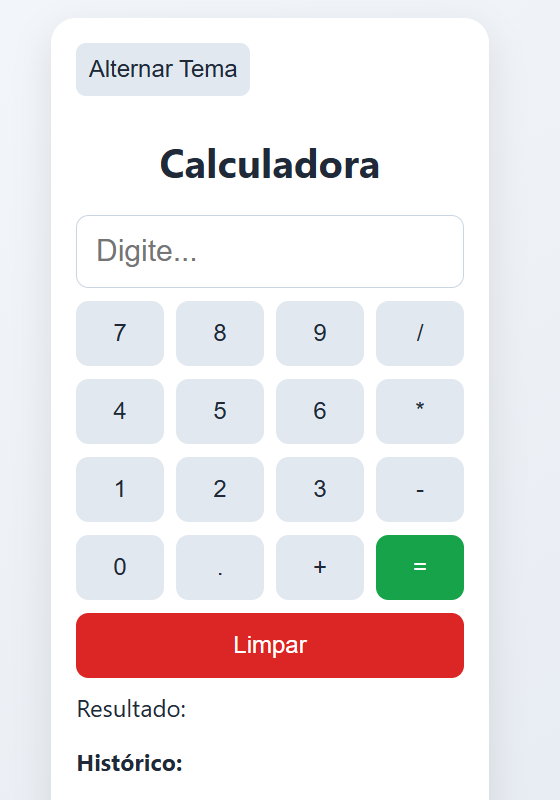

# 🧮 Calculadora Simples

Uma calculadora web simples e responsiva, feita com **HTML**, **CSS** e **JavaScript puro**.

## 🚀 Funcionalidades

* ✅ Operações básicas: Soma, Subtração, Multiplicação e Divisão
* ✅ Exibição do resultado em tempo real
* ✅ Histórico de cálculos
* ✅ Tema Claro e Escuro (alternável)
* ✅ Interface responsiva e moderna

## 🎨 Preview



## 📁 Estrutura de Arquivos

```
calculadora/
│
├── index.html        → Estrutura do site
├── style.css         → Estilo e temas (claro/escuro)
├── script.js         → Funcionalidade da calculadora
└── README.md         → Documentação
```

## 🚦 Como executar

1. Clone ou baixe este repositório.
2. Abra o arquivo `index.html` no seu navegador.
3. Pronto! A calculadora estará funcionando.

## 🛠 Tecnologias Utilizadas

* HTML5
* CSS3
* JavaScript Puro

## 🌗 Alternância de Tema

Use o botão **“Alternar Tema”** para mudar entre tema claro e escuro de forma dinâmica.

## 📜 Licença

Este projeto está sob a licença **MIT** — sinta-se livre para usar e modificar.

---

> 
